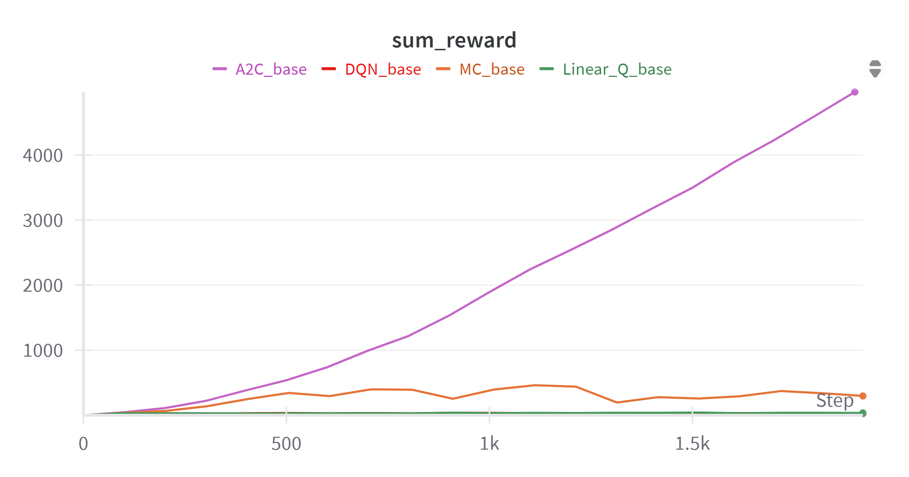

# FRA503-HW3: Cart Pole [ HW3 ]

Similar to the previous homework, this assignment focuses on the **Stabilizing Cart-Pole Task**, but using function approximation-based RL approaches instead of table-based RL approaches.

Additionally, as in the previous homework, the `CartPole` extension repository includes configurations for the **Swing-up Cart-Pole Task** as an optional resource for students seeking a more challenging task.

## Table of Contents
- [FRA503-HW3: Cart Pole \[ HW3 \]](#fra503-hw3-cart-pole--hw3-)
  - [Table of Contents](#table-of-contents)
  - [Learning Objectives:](#learning-objectives)
  - [Part 1: Understanding the Algorithm](#part-1-understanding-the-algorithm)
    - [Linear Q-Learning](#linear-q-learning)
    - [Deep Q-Network (DQN)](#deep-q-network-dqn)
    - [REINFORCE (Monte Carlo Policy Gradient)](#reinforce-monte-carlo-policy-gradient)
    - [Advantage Actor‑Critic (A2C)](#advantage-actorcritic-a2c)
  - [**Part 2: Evaluate Cart-Pole Agent performance.**](#part-2-evaluate-cart-pole-agent-performance)
    - [**2.1 Compare result each algorithm**](#21-compare-result-each-algorithm)
    - [**2.2 How well the agent from `REINFORCE (Monte Carlo Policy Gradient)` and `Advantage Actor‑Critic (A2C)` learns to receive higher rewards**](#22-how-well-the-agent-from-reinforce-monte-carlo-policy-gradient-and-advantage-actorcritic-a2c-learns-to-receive-higher-rewards)
      - [2.2.1 `REINFORCE (Monte Carlo Policy Gradient)`](#221-reinforce-monte-carlo-policy-gradient)
      - [2.2.2 `Advantage Actor‑Critic (A2C)`](#222-advantage-actorcritic-a2c)
    - [**2.3 How well the agent from `REINFORCE (Monte Carlo Policy Gradient)` and `Advantage Actor‑Critic (A2C)` performs in the Cart-Pole problem**](#23-how-well-the-agent-from-reinforce-monte-carlo-policy-gradient-and-advantage-actorcritic-a2c-performs-in-the-cart-pole-problem)
      - [2.3.1 `REINFORCE (Monte Carlo Policy Gradient)`](#231-reinforce-monte-carlo-policy-gradient)
      - [2.3.2 `Advantage Actor‑Critic (A2C)`](#232-advantage-actorcritic-a2c)
    - [**2.4 Which algorithm performs best?**](#24-which-algorithm-performs-best)
    - [**2.5 Why does `Advantage Actor‑Critic (A2C)` perform better than the others?**](#25-why-does-advantage-actorcritic-a2c-perform-better-than-the-others)


## Learning Objectives:
1. Understand how **function approximation** works and how to implement it.

2. Understand how **policy-based RL** works and how to implement it.

3. Understand how advanced RL algorithms balance exploration and exploitation.

4. Be able to differentiate RL algorithms based on stochastic or deterministic policies, as well as value-based, policy-based, or Actor-Critic approaches. 

5. Gain insight into different reinforcement learning algorithms, including Linear Q-Learning, Deep Q-Network (DQN), the REINFORCE algorithm, and the Actor-Critic algorithm. Analyze their strengths and weaknesses.


## Part 1: Understanding the Algorithm
 
 ### Linear Q-Learning
 Linear Q-Learning is a `value-based` method that approximates the action-value function $ Q(s, a)$ in every state and action, and store the Q-value in table as a linear combination of feature vector $ \phi(s, a) $. The policy is `deterministic` and select an optimal action by maximizing the action-value function illustrated as below 

 $$ a^* = \arg\max_a Q(s, a) $$

 and an $\epsilon$-greedy variant thereof the exploration because it's the linear approximation. The **observation space** is `continuous` (joint limit in radian) while the *action space* is `discrete` for maximizing step. The exploration and exploitation is balanced by adjusting an $\epsilon$ decayed in **$\epsilon$-greedy policy**.

 ### Deep Q-Network (DQN)
 DQN is the Q-Learning (`value-based`) that use neural network to approximates the action-value function $ Q(s, a)$ instead of storing all the Q-value in table. The policy is `deterministic` greedy for exploitation; $\epsilon$-greedy bahaviour during learning and at the test time the agent select an optimal action by maximizing the action-value function illustrated as below 
 $$ a^* = \arg\max_a Q(s, a) $$

while training injects stochastic exploration by taking a random action with probability $\epsilon$

The *observation space *is `continuous` which high/low-dimensional features are also work. The *action space* is only `discrete` which produces one scalar value per action. And the **balancing exploration and exploitation** with three components consist of **$\epsilon$-greedy decayed** from a large value to a small floor to focus on exploration and exploitation, **experience replay buffer** by storing past transition $(s, a, r, s')$ to re‑use rare but informative experiences, improving both exploration coverage and data efficiency. and **target network** to stabilize learning by copied set of parameter provides a slowly changing boostrap target  so that the greedy policy exploits estimates rather than oscillating ones.

### REINFORCE (Monte Carlo Policy Gradient)
REINFORCE is a policy‑based Monte Carlo algorithm that directly optimizes a stochastic policy $ \pi(a \mid s; \theta)$ by performing gradient ascent on the expected return:

$$\nabla_{\theta} J(\theta) = \mathbb{E} \left[ \nabla_{\theta} \log \pi(a \mid s; \theta) G_t \right]
$$

which 
- $\nabla_{\theta} J(\theta)$: radient of the expected return $J(\theta)$ with respect to policy parameters $\theta$

- $\mathbb{E}[]$: Expectation over the distribution induced by the policy

- $\log \pi(a \mid s; \theta)$: Log-probability of taking action $q$ under policy $\pi$

- $G_t$: Return (e.g., cumulative discounted reward) starting from time $t$

Learning policy is `stochastic` with supports both `discrete and continuous` in action spaces by choosing an appropriate distribution (softmax of gaussian) and can be `continuous and discrete` observation spaces. Exploration is sampling from the stochastic policy supplies intrinsic exploration; entropy bonus often added to delay premature exploitation  

### Advantage Actor‑Critic (A2C)
Actor-Critic method is the `combination between value-based and policy-based`. The actor learns a `stochastic` policy  $\log \pi(a \mid s; \theta)$ (softmax for discrete or Gaussian for continuous actions),  while the critic estimates a value function $V(s; w)$

$$A(s, a) = r + \gamma V(s'; w) - V(s; w) $$

It uses the advantage reduces variance in policy gradient update. This approach handles `continuous or discrete` observation spaces and can applies both `continuous or discrete` in action spaces. Exploration comes from the randomness in policy $\pi$ often boosted by `entropy`. Exploitation is guided by the `critic`, helping the actor choose high-reward actions.  

## **Part 2: Evaluate Cart-Pole Agent performance.**

### **2.1 Compare result each algorithm**
**Assumption:** Set hyperparameter for every algorithm as below
```python
# hyperparameters
num_of_action = 7
action_range = [-2.5, 2.5]  
learning_rate = 0.01
hidden_dim = 64
n_episodes = 2000
initial_epsilon = 1.0
epsilon_decay = 0.99997  
final_epsilon = 0.001
discount = 0.95
buffer_size = 100000
batch_size = 64
```



From image the best algorithm that can stabilize longest is `REINFORCE (Monte Carlo Policy Gradient)` and `Advantage Actor‑Critic (A2C)` so we will test parameter that effect with this algorithm.

Before see how parameter effect with this algorithm. I will tell more about `Linear Q-Learning` and `Deep Q-Network (DQN)` 


From above image the reward of both algorithm have characteristic like step function and it can not increase more that i think because
- The agent discovered a decent strategy but not the best.
- ε too small too soon


### **2.2 How well the agent from `REINFORCE (Monte Carlo Policy Gradient)` and `Advantage Actor‑Critic (A2C)` learns to receive higher rewards**

#### 2.2.1 `REINFORCE (Monte Carlo Policy Gradient)`
- `learning_rate`: adjust in step 0.01 (Orange), 0.005 (Green), 0.0001 (Blue)

From this test
  - Increase `learning_rate`: learning faster but reward may swing more
  - Decrease `learning_rate`: learning slower but reward swing less

- `discount`: adjust in step 0.95 (Orange), 0.98 (Green), 0.99 (Blue)

From this test
  - Increase `discount`: May slow convergence or make learning harder due to distant rewards being weighted heavily.

  - Decrease `discount`: Agent focuses only on immediate reward → fails to balance pole long-term.


#### 2.2.2 `Advantage Actor‑Critic (A2C)`

### **2.3 How well the agent from `REINFORCE (Monte Carlo Policy Gradient)` and `Advantage Actor‑Critic (A2C)` performs in the Cart-Pole problem**

#### 2.3.1 `REINFORCE (Monte Carlo Policy Gradient)`

In `REINFORCE (Monte Carlo Policy Gradient)` when sum_reward > 400 Cart can stabilize pole and cart not move until out of rail. You can see it in video at below.

https://github.com/user-attachments/assets/94754604-17bb-4050-a93b-0216224d15f6

but when sum_reward drop under 400 Cart still can stabilize pole but cart start to move until out of rail.

https://github.com/user-attachments/assets/f7d1f99f-e923-418d-b2ea-1a9a16d3136e

This case is happen because as you've seen the `sum_reward` which has some the lowest valley called **local optima**. My assumption goes to the initial state when it randomed the pole closes to the 0 radient and it can survive longer (get more reward). So the algorithm just has the strategy that only **good enough** but not exploring the **best strategy** (or the robust one). 

From the loss graph show that when the sum_reward per episode is high, loss is low.


#### 2.3.2 `Advantage Actor‑Critic (A2C)`


https://github.com/user-attachments/assets/19f0eb07-e47c-4412-be3c-08737f9b5b55

As you can see from the video that Cartpole can stabilize upward but still slip onto the right and run out of the rail. Meanwhile From the `sum_reward` graph, There is a tendency to increase continuously. It's caused from the serveral reasons. One of them is from the learning of algorithm that think it was the best strategy to balance the pole. Or the reward function aims to stabilze the cartpole (radient equal to zero) with not covering to control the cart within range of the rail. This is the reason why `sum_reward` increased and the cart sliped out of the rail. 

From the loss graph: 
- At 0-600 step, actor‑loss swings between ≈ +30 and –20.
Critic‑loss and total‑loss spike into the thousands, then begin to slope downward. The policy is still random. Episodes are short (the pole falls quickly). The critic keeps guessing the remaining lifetime of the episode and is usually wrong.

- At 600-1000 step, Both losses decrease sharply. Actor‑loss fluctuations squeeze into a ±5 band, critic‑loss collapses toward 0. The agent has discovered a `stable balancing routine`. 

- After 1000, Losses around near zero with only thin noise; two tall critic‑loss spikes re‑appear around step 1 500. CartPole is basically solved (in term of stabilizing) but the rare spike might come from random early termination (ran out of the rail) or an exploratory action.  

### **2.4 Which algorithm performs best?**
From sum_reward graph. The algorithm that have the best performe is `Advantage Actor‑Critic (A2C)` 

### **2.5 Why does `Advantage Actor‑Critic (A2C)` perform better than the others?**

In video you will see `Advantage Actor‑Critic (A2C)` and `REINFORCE (Monte Carlo Policy Gradient)` it perform likely. I think the problem is that the rewards and de-rewards do not cover the location of the cart. but the reward in A2C it increase more and stable MC, I think if we can fix the ploblem that i told it can perform better. So the more advantage of A2C is

1. **Combines Strengths of Value & Policy-Based Methods**
   
    A2C is a hybrid of:

    - Policy gradient (like REINFORCE)

    - Value function estimation (like Q-learning)

    By combining both, A2C:

    - Directly optimizes the policy (like REINFORCE)

    - Uses the value function to reduce variance (unlike REINFORCE)

    - This means more stable updates and better learning efficiency.

2. **Uses Advantage Function**

    Instead of using the full return like REINFORCE, A2C uses:

    $$A(s, a) = r + \gamma V(s'; w) - V(s; w) $$

    This "advantage" tells the agent how much better an action was compared to average, which:

    - Helps focus on better-than-expected actions

    - Reduces variance in updates

    - Speeds up convergence

3. **On-Policy and Synchronous Updates**
   
    A2C performs synchronous updates — all environments (or rollouts) contribute to a single update step. This:

    - Keeps learning stable and consistent

    - Improves performance on tasks like CartPole where fast, frequent learning from recent experience matters

4. **Better Exploration Through Stochastic Policy**
   
    CartPole needs exploration, especially early on. A2C uses a stochastic policy:

    - Not always picking the greedy action

    - Enables smooth exploration without tricks like epsilon-greedy (used in Q-learning or DQN)